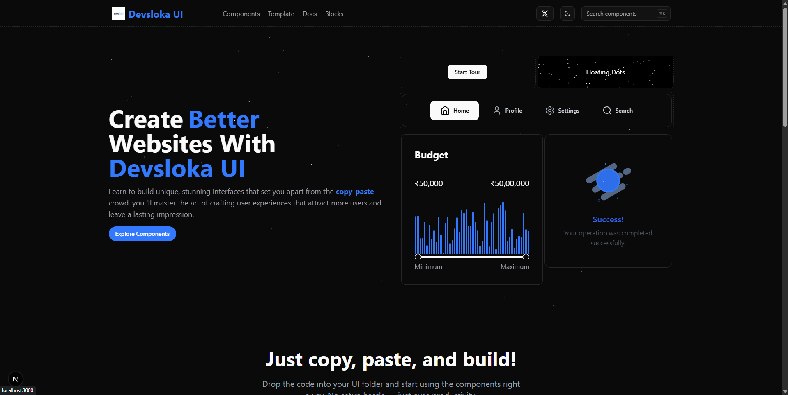

# Devsloka UI 🌟

[](https://opensource.org/licenses/MIT)


> **Devsloka UI** is a free, open-source React component library and template collection for building beautiful, animated, and accessible UIs with Next.js, Remix, and React Router. Powered by Tailwind CSS, Framer Motion, and Radix UI.



---

## ✨ Features

- **50+ Production-Ready Components**: Buttons, Cards, Forms, Navigation, Carousels, and more
- **Prebuilt Blocks & Templates**: Hero sections, pricing, testimonials, footers, dashboards, and landing pages
- **Modern Styling**: Tailwind CSS, CSS Variables, and theme support
- **Accessibility First**: WCAG 2.1 compliant, keyboard navigation, and ARIA
- **TypeScript Support**: Full type definitions for all components
- **Dark/Light Mode**: Built-in theme switching
- **Zero Vendor Lock-in**: Use with Next.js, Remix, or React Router
- **Easy Copy-Paste Usage**: Drop code into your project and go

---

## 📦 Installation

```bash
# With npm
npx shadcn@latest add https://ui.devsloka.in/r/component-name
# Or with bun
bunx shadcn@latest add https://ui.devsloka.in/r/component-name
```

> Or simply copy-paste any component from the `/src/registry/ui` or `/src/registry/blocks` folders into your project.

---

## 🚀 Usage

1. **Import a component:**
	```tsx
	import { Button } from "@/components/ui/button";
   
	export default function Example() {
	  return <Button>Click me</Button>;
	}
	```
2. **Or copy-paste from the registry:**
	- UI Components: [`src/registry/ui`](src/registry/ui)
	- Blocks: [`src/registry/blocks`](src/registry/blocks)
	- Templates: [`src/lib/templates.ts`](src/lib/templates.ts)

---

## 🧩 Components & Blocks

### UI Components

- Airbnb Card
- Animated Image Gallery
- Animated Multi-Select
- Animated Smartwatch
- Border Gradient Icon
- Card Decorator
- Card Radio
- Content Carousel
- Empty Result
- Error Result
- Expanding Cards
- Floating Dots
- Gradient Text
- Icon Radio
- Laptop Closes on Scroll
- Loader
- Logo Cloud Carousel
- Morphing Card
- Morphing Modal
- Morphing Nav
- Pricing Card
- Product Card
- Range Slider with Histogram
- Success Result
- Tabs Switcher
- Text Effect
- Tour

### Blocks

- Contact Block
- FAQ Block
- Features Block
- Feature Floating Showcase
- Feature Interactive Cards
- Footer Block
- Floating Footer
- Grid Footer
- Hero Section (multiple variants)
- Logo Cloud Block
- Newsletter Block
- Pricing Block
- Team Block
- Testimonials Block
- Wave Footer

See [`src/registry/blocks`](src/registry/blocks) for all block code.

---

## 🎨 Theming & Customization

- Built with [Tailwind CSS](https://tailwindcss.com/) and CSS variables
- Multiple color themes: see [`src/app/themes.css`](src/app/themes.css)
- Easily switch between dark/light mode
- Customize fonts, colors, and spacing in [`tailwind.config.js`](tailwind.config.js)

---

## 📚 Documentation & Playground

- [Documentation Website](https://ui.devsloka.in/)
- [Component Playground](https://ui.devsloka.in/playground)

---

## 📄 License

MIT License - See [LICENSE](LICENSE) for details.

---

Built with ❤️ by the [Devsloka](https://www.devsloka.in/)

---

_Report Issues · Request Features · Join the Community!_
